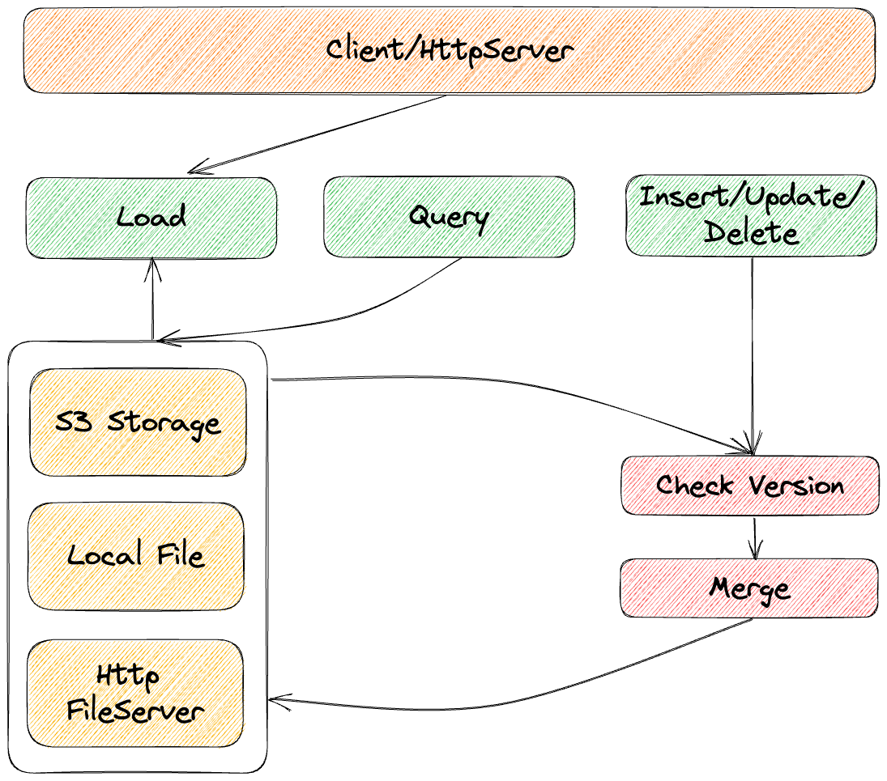

# LessDB 

[](https://github.com/linkxzhou/LessDB/actions/workflows/build1.20.yml)
[](https://github.com/linkxzhou/LessDB/actions/workflows/build1.21.yml)

LessDB a serverless SQLite service designed to simplify the use of cloud-based MySQL, PostgreSQL, and other databases. The project is still in the planning stage, and the planned features include.

- [x] HTTP JSON API
- [x] Optimizing Security
- [ ] Sqlite Cli
- [x] S3 Object Storage
- [ ] Asynchronously Execute SQL for Eventual Consistency
- [x] Local Cache File
- [ ] Compatible with MySQL Protocol
- [ ] Support Uploading Various Data Formats and Converting them into SQLite Files

### Installation

```
go get github.com/linkxzhou/LessDB
```
OR
```
git clone git@github.com:linkxzhou/LessDB.git
cd LessDB/cmd/http
go build .
```

### Architecture


### HTTP JSON API

**（1）create databases**  
```
POST http://localhost:18090/api/v1/createdb
Content-Type: application/json

{
    "list": [
        {
            "cmd": "CREATE TABLE IF NOT EXISTS foo1 (id text NOT NULL PRIMARY KEY,title text)",
            "args": []
        },
        {
            "cmd": "CREATE TABLE IF NOT EXISTS foo2 (id text NOT NULL PRIMARY KEY,title text)",
            "args": []
        },
        {
            "cmd": "INSERT INTO foo1 (id, title) values (?, ?)",
            "args": [415, "romantic-swell"]
        },
        {
            "cmd": "INSERT INTO foo2 (id, title) values (?, ?)",
            "args": [415, "romantic-swell"]
        }
    ]
}
```

**（2）query tables**  
```
GET http://localhost:18090/api/v1/{readkey}/tables?limit=10&offset=0
Content-Type: application/json
```

**（3）query rows**  
```
GET http://localhost:18090/api/v1/{readkey}/tables/foo1/rows?limit=100&offset=0
Content-Type: application/json
```

**（4）execute sql: asynchronously execute SQL**  
```
POST http://localhost:18090/api/v1/{readkey}/execute?writekey={writekey}
Content-Type: application/json

{
    "list": [
        {
            "cmd": "CREATE TABLE IF NOT EXISTS foo1 (id text NOT NULL PRIMARY KEY,title text)",
            "args": []
        },
        {
            "cmd": "CREATE TABLE IF NOT EXISTS foo2 (id text NOT NULL PRIMARY KEY,title text)",
            "args": []
        },
        {
            "cmd": "INSERT INTO foo1 (id, title) values (?, ?)",
            "args": [1, "unique-title-1"]
        },
        {
            "cmd": "INSERT INTO foo1 (id, title) values (?, ?)",
            "args": [2, "unique-title-2"]
        }
    ]
}
```

**（5）execute sql for query data**  
```
POST http://localhost:18090/api/v1/{readkey}/query
Content-Type: application/json

{
    "list": [
        {
            "cmd": "select * from foo1"
        },
        {
            "cmd": "select * from foo2"
        }
    ]
}
```

**（6）query asynchronously log**  
```
POST http://localhost:18090/api/v1/{readkey}/executelog
Content-Type: application/json

{
    "seqid": "{seqid}"
}
```

# Goal

Serve small and medium-sized developers, reducing the cost of cloud services.

### Quotation
[1] https://github.com/rqlite/rqlite   
[2] https://github.com/psanford/sqlite3vfs    
[3] https://github.com/mattn/go-sqlite3     
[4] https://github.com/kahing/goofys   
[5] https://github.com/turbobytes/infreqdb   
[6] https://github.com/rclone/rclone    
[7] https://ieeexplore.ieee.org/abstract/document/9101371   
[8] https://dl.acm.org/doi/abs/10.1145/1376616.1376645   