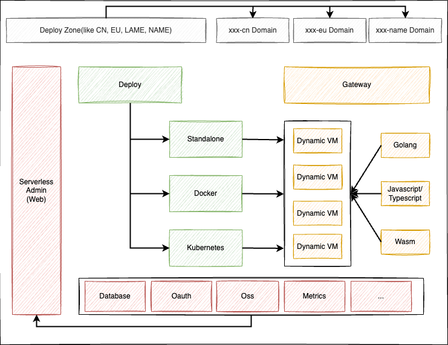

## Serverless Platform build with golang.

## Milestone

- [] Interpreter
    - [x] Golang
    - [] Javascript/Typescript
    - [] Wasm
- [] Gateway
- [] Deploy
    - [] Standalone
    - [] Docker
    - [] Kubernetes
- [] Serverless Admin
    - [] Api
    - [] Web Pages
- [] Database Schema
    - [x] Mysql
    - [x] Sqlite
    - [] Mongodb
    - [] PostgreSQL
- [] Util Packages
- [] Support variable 
- [] Unit Tests

### Architecture
